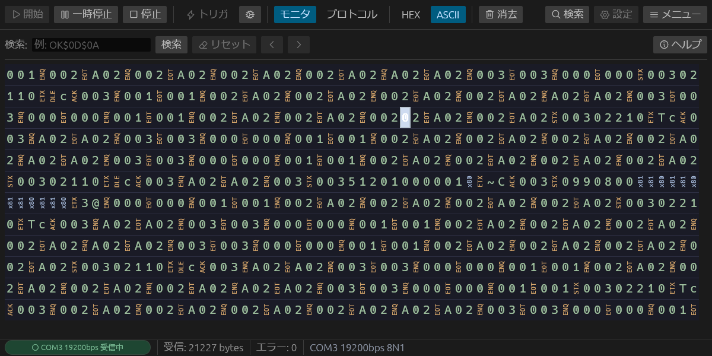
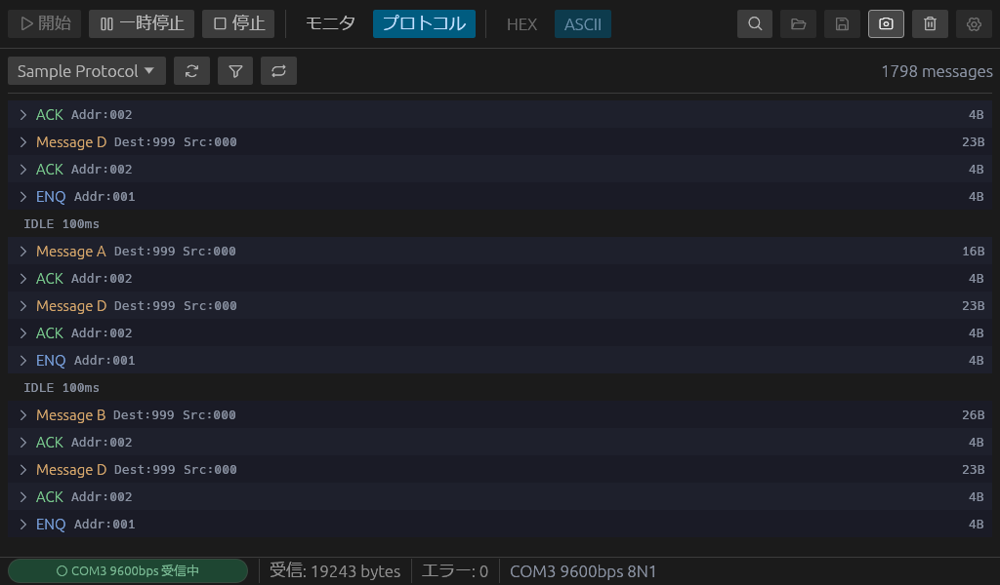
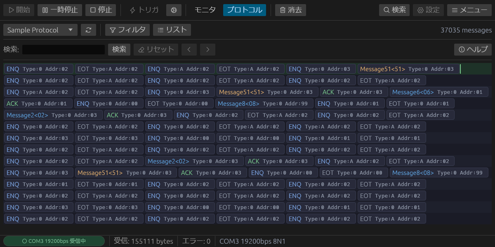

# Glass

**日本語** | [English](README.md)

Windows向けの半二重シリアルモニタ。Rust + egui で構築。



## 特徴

- **HEX / ASCII 表示モード** — リアルタイムに切替可能
- **IDLE検出** — 閾値（ms）を設定可能、視覚的なマーカー表示
- **混合パターン検索** — HEXバイト（`$XX`）とASCIIテキストを組み合わせて検索（例: `OK$0D$0A`）
- **保存 / 読込** — キャプチャデータを `.glm` 形式でエクスポート・インポート（タイミング情報保持）
- **スクリーンショット** — 現在のウィンドウをPNGで保存
- **日本語 / 英語 UI** — 設定から切替可能
- **シリアル設定** — ボーレート、データビット、パリティ、ストップビット
- **ダークテーマ** — 長時間のモニタリングに配慮した目に優しいデザイン
- **エラー追跡** — フレーミング、オーバーラン、パリティエラーのカウント
- **プロトコル定義** — TOML形式のプロトコル定義によるフレーム自動抽出・メッセージデコード
- **選択 & コピー** — モニタ・プロトコル画面で範囲選択し、Ctrl+Cまたは右クリックメニューでコピー（ASCII / HEX / バイナリ形式）

## プロトコル定義

`protocols/` ディレクトリにTOMLファイルでプロトコルを定義すると、受信バイト列からフレームを自動抽出し、パターンマッチでメッセージを識別・フィールドをデコードします。

### リスト表示

マッチしたメッセージをスクロール可能なリストで表示。色付きタイトルとインラインフィールドが一覧でき、クリックでフィールド詳細を展開できます。



### ラップ表示

メッセージをコンパクトなピルとして折り返しレイアウトで表示。ライブ監視中は循環バッファとカーソルキャレットで現在の書き込み位置を示します。



### TOML形式

```toml
[protocol]
title = "My Protocol"
frame_idle_threshold_ms = 5.0

# フレームルール: 生バイト列からフレームを抽出する方法を定義
[[protocol.frame_rules]]
trigger = "02"       # 開始バイト (hex)
end = "03"           # 終了バイト
end_extra = 2        # 終了バイト後の追加バイト数 (例: チェックサム)
max_length = 256

# メッセージ定義: HEX正規表現パターンでフレームを照合
[[messages]]
id = "msg_a"
title = "Message A"
color = "D4A56A"
pattern = "^02[0-9A-F]{6}03[0-9A-F]{4}$"

[[messages.fields]]
name = "Addr"
offset = 1
size = 3
inline = true        # リスト行にインライン表示
description = "宛先アドレス"
```

## 動作環境

- Windows 10 / 11
- Rust ツールチェイン（ソースからビルドする場合）

## ビルド・実行

```bash
cargo build --release
cargo run --release
```

## 使い方

1. **設定**でCOMポートを選択し、シリアルパラメータを設定
2. **開始**をクリックしてデータ受信を開始
3. **HEX** / **ASCII** 表示モードを切替
4. **Ctrl+F** で検索バーを開く
   - HEXバイト: `$0D$0A`
   - ASCIIテキスト: `OK`
   - 混合: `OK$0D$0A`
5. **一時停止**で表示を固定（バッファリングは継続）
6. **ドラッグ**で範囲選択し、**Ctrl+C** または **右クリック → コピー** でクリップボードにコピー
   - モニタ: 右クリックメニューでASCII / HEX / バイナリ形式を選択可能
   - プロトコル: クリック / Shift+クリック / ドラッグで選択、ダブルクリックで詳細表示
7. **保存**でキャプチャデータを `.glm` にエクスポート、**読込**で過去のセッションをインポート

## ファイル形式 (.glm)

Glass Monitor ファイル（`.glm`）はJSON形式で、以下を保存します:

- キャプチャ時のシリアル設定
- マイクロ秒精度の相対タイムスタンプ付きバイトデータ
- IDLEマーカー

## ライセンス

MIT
