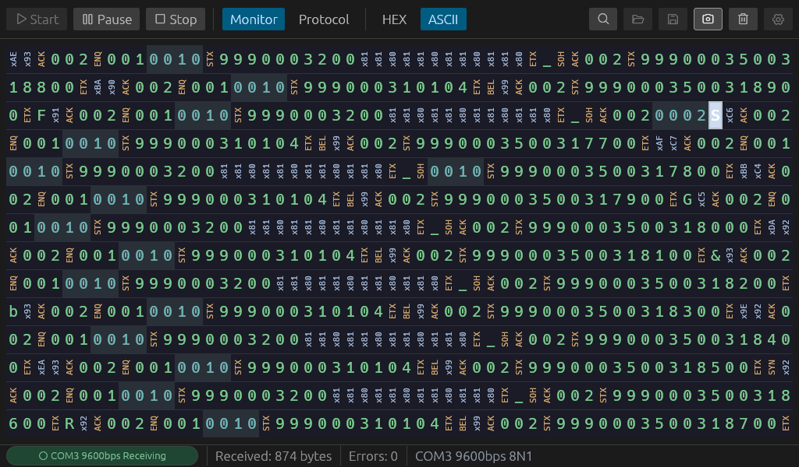
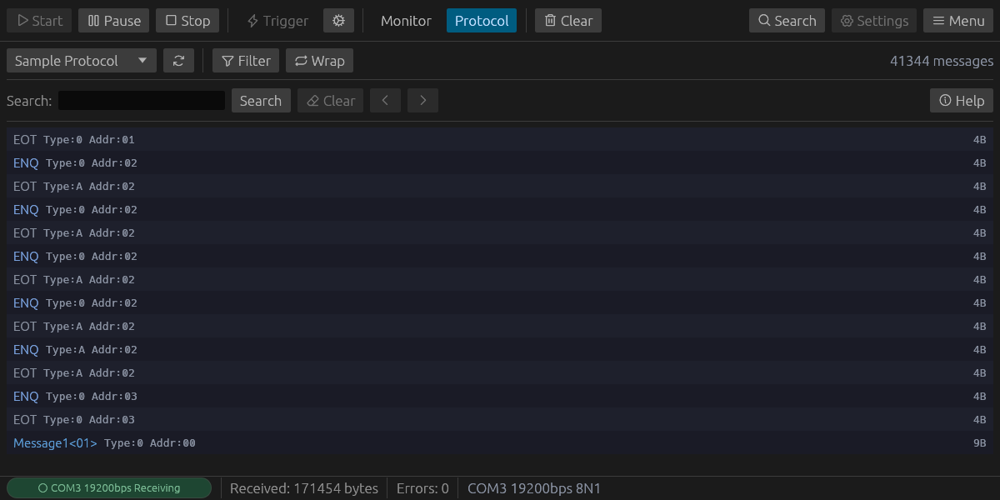
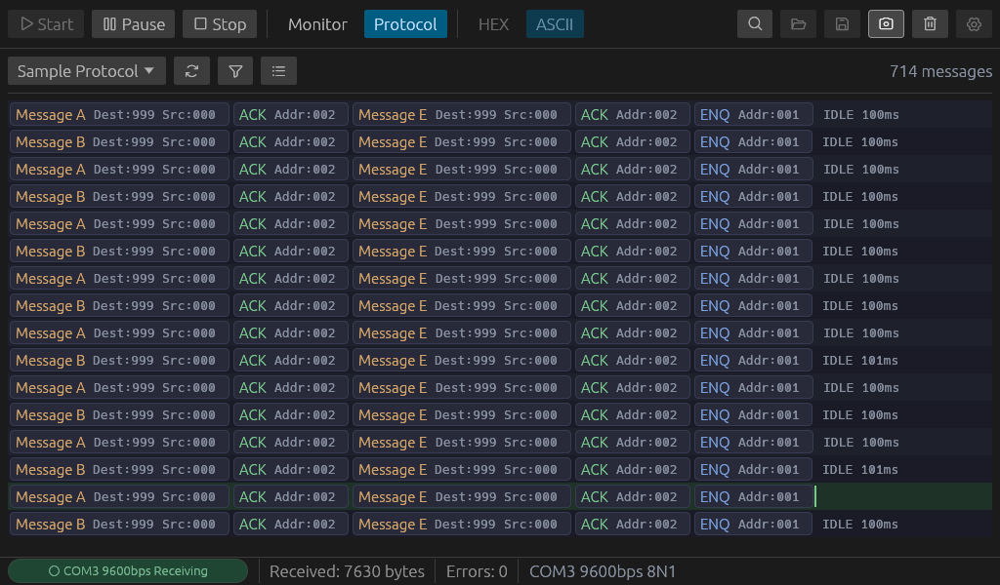

# Glass

[日本語](README.ja.md) | **English**

A half-duplex serial monitor for Windows, built with Rust and egui.



## Features

- **HEX / ASCII display modes** — switch on the fly
- **IDLE detection** — configurable threshold (ms) with visual markers
- **Mixed pattern search** — combine hex bytes (`$XX`) and ASCII text in one query (e.g. `OK$0D$0A`)
- **Save / Load** — export and import captured data in `.glm` format with timing preserved
- **Screenshot** — capture the current window as PNG
- **Bilingual UI** — Japanese / English, switchable in settings
- **Serial configuration** — baud rate, data bits, parity, stop bits
- **Dark theme** — eye-friendly for long monitoring sessions
- **Error tracking** — framing, overrun, and parity error counts
- **Protocol definition** — TOML-based protocol definitions for automatic frame extraction and message decoding
- **Selection & Copy** — select ranges in monitor or protocol views, copy via Ctrl+C or right-click menu (ASCII, HEX, binary formats)

## Protocol Definition

Define communication protocols in TOML files under the `protocols/` directory. Glass automatically extracts frames from raw serial data, matches them against message patterns, and decodes fields.

### List View

Matched messages are displayed in a scrollable list with colored titles and inline fields. Click a message to expand its full field details.



### Wrap View

Messages are displayed as compact pills in a wrapping layout. During live monitoring, a circular buffer with a cursor caret shows the current write position.



### TOML Format

```toml
[protocol]
title = "My Protocol"
frame_idle_threshold_ms = 5.0

# Frame rules define how raw bytes are extracted into frames
[[protocol.frame_rules]]
trigger = "02"       # Start byte (hex)
end = "03"           # End byte
end_extra = 2        # Extra bytes after end (e.g. checksum)
max_length = 256

# Message definitions match frames by HEX regex pattern
[[messages]]
id = "msg_a"
title = "Message A"
color = "D4A56A"
pattern = "^02[0-9A-F]{6}03[0-9A-F]{4}$"

[[messages.fields]]
name = "Addr"
offset = 1
size = 3
inline = true        # Show in list row
description = "Destination address"
```

## Requirements

- Windows 10 / 11
- Rust toolchain (for building from source)

## Build & Run

```bash
cargo build --release
cargo run --release
```

## Usage

1. Select a COM port and configure serial parameters in **Settings**
2. Click **Start** to begin receiving data
3. Toggle between **HEX** and **ASCII** display modes
4. Use **Ctrl+F** to open the search bar
   - Hex bytes: `$0D$0A`
   - ASCII text: `OK`
   - Mixed: `OK$0D$0A`
5. **Pause** to freeze the display while continuing to buffer data
6. Select a range by **click & drag**, then **Ctrl+C** or **right-click → Copy** to copy to clipboard
   - Monitor: choose ASCII, HEX, or binary format from the context menu
   - Protocol: click / Shift+click / drag to select messages; double-click to open details
7. **Save** to export captured data as `.glm`, or **Load** to import a previous session

## File Format (.glm)

Glass Monitor files (`.glm`) are JSON-based and store:

- Serial configuration used during capture
- Byte data with microsecond-precision relative timestamps
- IDLE markers

## License

MIT
